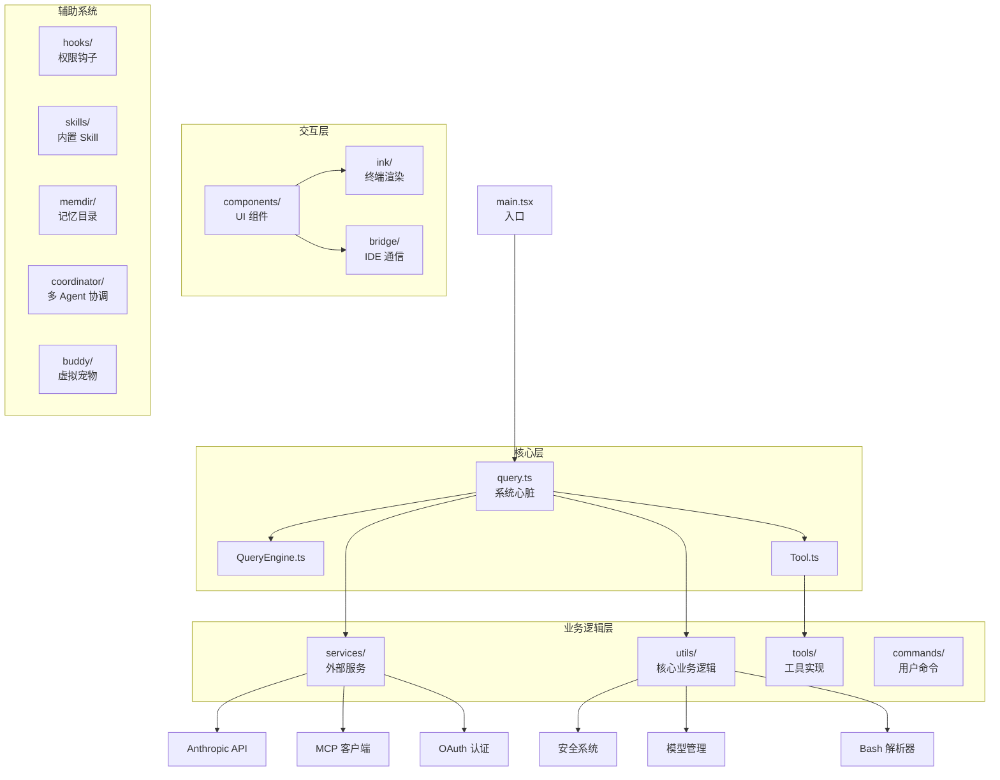
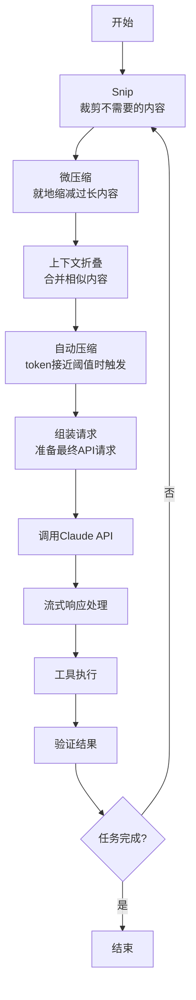
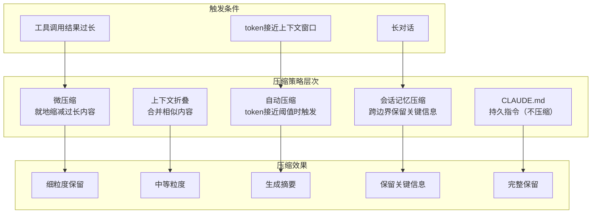
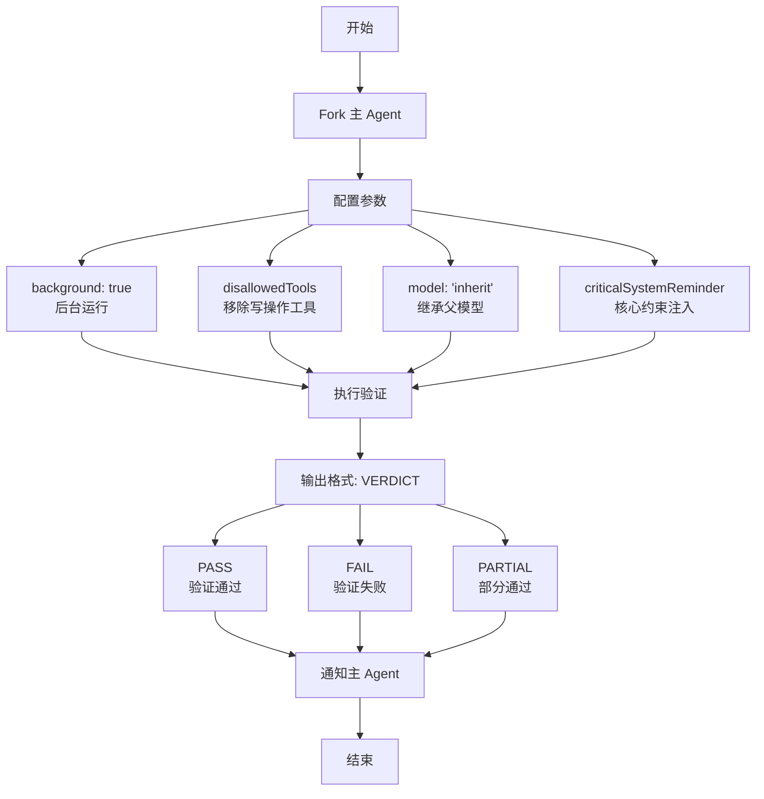
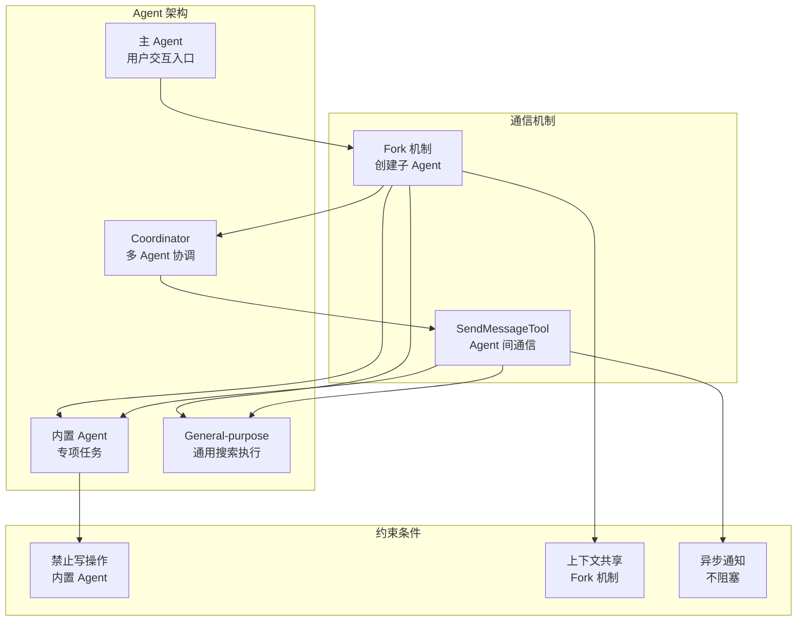
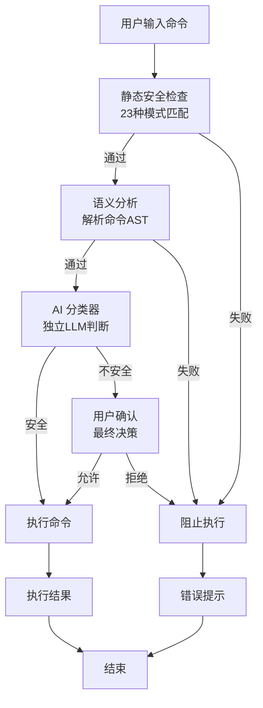
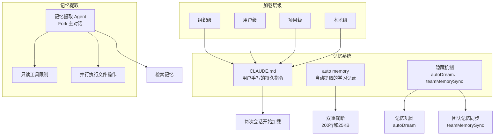

# Claude Code 源码深度分析

## 1. 源码泄露事件

2026 年 3 月 31 日，安全研究员 Chaofan Shou 在 X 上发现 Claude Code 源码通过 npm 包中的 .map 文件泄露。该 source map 指向了 Anthropic R2 存储桶中未混淆的 TypeScript 源码，暴露了整个 src/ 目录，包含 1902 个源文件，共 512,685 行 TypeScript 代码。

## 2. 整体架构

### 代码结构
- **utils/**：180K 行，占总量的三分之一，包含权限系统、安全检查、模型管理等核心逻辑
- **components/**：81K 行，140 多个 Ink 终端 UI 组件
- **services/**：53K 行，封装外部服务（Anthropic API、MCP 客户端、OAuth 等）
- **tools/**：50K 行，40 多个 Agent 工具的实现
- **commands/**：26K 行，50 多个用户斜杠命令
- 其他目录：hooks/、bridge/、cli/、skills/、memdir/、coordinator/、buddy/ 等

### 整体架构图

### 核心架构特点
- **query.ts**：系统心脏，所有数据流的汇聚点
- **AgentTool 递归调用**：子 Agent 是新的 query loop 实例，支持无限嵌套
- **关注点分离**：query.ts 管循环编排，工具管执行，权限系统管判断，UI 管展示

## 3. Agentic Loop 五步流水线

### 五步预处理流水线

1. **Snip**：裁剪不需要的内容
2. **微压缩**：就地缩减过长内容
3. **上下文折叠**：合并相似内容
4. **自动压缩**：当 token 接近上下文窗口时触发
5. **组装请求**：准备最终 API 请求

### 流式执行优化
- **StreamingToolExecutor**：在模型还在输出时就开始准备工具调用
- **Fallback 机制**：主模型失败时切换到 fallback model 重试
- **用户中断处理**：为未完成的 tool_use block 补 error 类型的 tool_result

## 4. 上下文压缩策略

### 多层压缩策略

- **微压缩**：最细粒度，工具调用结果过长时就地缩减
- **自动压缩**：token 接近上下文窗口时触发，预留 20K token 给压缩摘要
- **会话记忆压缩**：跨 compact 边界保留关键信息
- **响应式压缩**和**上下文折叠**：实验性策略

### 架构约束
- **CLAUDE.md**：四层加载层级（组织级 → 用户级 → 项目级 → 本地），在每次会话开始时加载，不受压缩影响

## 5. Verification Agent 设计

### Verification Agent 工作流程

### 核心特点
- **background: true**：在后台运行，不阻塞主 Agent 执行流
- **disallowedTools**：硬约束，直接移除写操作工具
- **model: 'inherit'**：继承父 Agent 模型，共享 prompt cache
- **criticalSystemReminder**：在每次用户 turn 重新注入的短消息，确保核心约束不丢失
- **精确输出格式**：VERDICT: PASS/FAIL/PARTIAL，方便程序解析

## 6. 三层 Agent 架构

### Agent 架构层次

- **内置 Agent**：做专项任务，禁止写操作
- **general-purpose**：做通用搜索和执行
- **Coordinator 模式**：多个 Agent 通过 SendMessageTool 互相通信

### Fork 机制
- 继承父 Agent 的完整对话上下文和 system prompt，共享 prompt cache
- 三条硬约束：不能偷看输出、不能换模型、异步通知不阻塞
- 价值在于把工作从主上下文中隔离出去

## 7. 安全架构

### 四层纵深防御

1. **静态安全检查**：23 种模式匹配，防御命令替换、zmodload、Unicode 零宽空格等
2. **语义分析**：解析命令 AST，理解实际意图，维护命令-操作类型映射表
3. **AI 分类器**：独立 LLM 调用判断命令安全性，失败时 fallback 到用户确认
4. **用户确认**：最终决策，记住用户选择形成规则

### 投机性预取
模型流式输出时并行运行分类器，减少用户等待时间

## 8. 记忆系统

### 三层记忆结构

### 三层记忆
- **CLAUDE.md**：用户手写的持久指令
- **auto memory**：自动提取的学习记录，双重截断（200 行和 25KB）
- **隐藏机制**：autoDream（记忆巩固）、teamMemorySync（团队记忆同步）

### 记忆提取 Agent
- 作为主对话的 fork 运行
- 严格的工具限制，只能用只读工具
- 优化 turn 数，并行执行文件读取和写入

## 9. 隐藏彩蛋

### Capybara
- Anthropic 内部下一代模型代号
- Capybara v8 的 false-claims rate 为 29-30%，v4 为 16.7%
- 用 String.fromCharCode 编码规避泄露检测

### Undercover Mode
- 内部员工给外部开源项目提交代码时自动激活
- 剥离归属信息、隐藏模型身份、拦截内部信息

### Tengu
- Claude Code 的内部项目代号
- 所有 analytics event 都以 tengu_ 为前缀

### KAIROS
- 完整的 "assistant 模式"
- 支持主动模式、记忆巩固、休眠唤醒等功能

### Anti-Distillation
- 防御竞争对手用 Claude 输出来训练模型
- 注入虚假工具调用模式

### Buddy System
- 虚拟宠物系统，基于 hash(userId) 生成
- 18 个物种、6 种眼睛、8 种帽子、5 个稀有度等级
- 5 项属性：DEBUGGING、PATIENCE、CHAOS、WISDOM、SNARK

## 10. 结论

Claude Code 的代码库揭示了 Agent Engineering 的真相：
- **6400 行** AI 交互核心代码
- **50 万行**工程基础设施
- 五步预处理流水线、多层上下文压缩、9300 行安全检查、四层纵深防御
- 从被动响应到主动执行，从单次对话到持续运行，从单人使用到团队协作的探索

这些在用户界面上完全不可见的工程细节，才是让 Agent 安全、高效、可靠运行的关键。