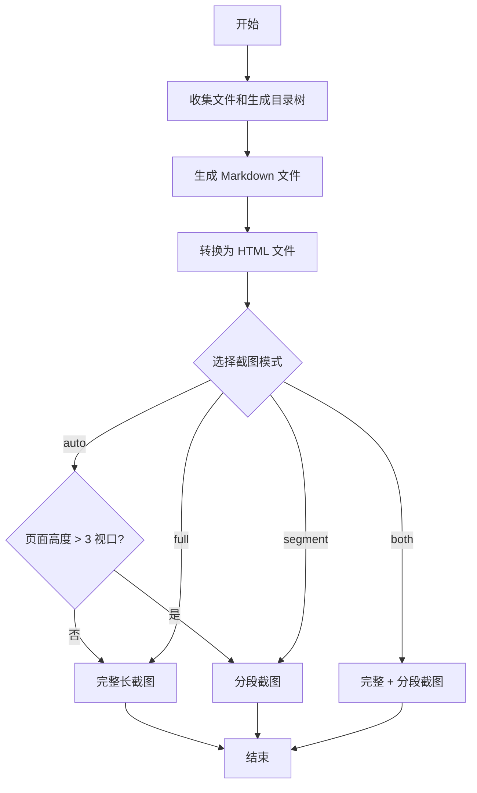

# Packager 工具详解

## 1. 工具简介

Packager 是一个项目打包工具，用于自动汇总指定目录下的所有文件，生成目录树总览、文件统计信息，并将所有文件内容整理到一个完整的 Markdown 文件中，同时转换为 HTML 并生成截图。

**主要功能**：
- 自动收集目录下的所有文件（排除指定目录和文件）
- 生成带图标的目录树总览
- 统计各目录下的文件数量
- 按目录分组整理文件内容到 Markdown
- 转换 Markdown 为带样式的 HTML
- 使用 Playwright 生成 HTML 页面的完整截图

## 2. 目录结构

```
packager/
├── main.py           # 主脚本（核心功能实现）
├── run.sh           # 一键执行脚本
├── requirements.txt # 依赖文件
├── .venv/           # 虚拟环境（自动创建）
└── output/          # 输出目录（自动创建）
    ├── package.md   # 生成的 Markdown 文件
    ├── package.html # 生成的 HTML 文件
    └── screenshots/ # 截图目录
        ├── package.png    # 完整截图（页面较短时）
        └── segments/      # 分段截图目录（页面较长时）
            ├── segment_0.png
            ├── segment_1.png
            └── segments.txt  # 分段信息文件
```

## 3. 核心功能详解

### 3.1 文件收集和目录树生成

`collect_files_and_generate_tree` 函数负责收集目录下的所有文件，并生成目录树结构：

- **排除目录**：`venv`, `.venv`, `__pycache__`, `.git`, `.idea`, `node_modules`, `packager` 等
- **排除文件**：`.DS_Store`, `Thumbs.db`, `.gitignore`, `.env` 等
- **排序**：按相对路径排序，确保输出顺序一致
- **目录树**：生成带图标的目录树结构，根据文件类型显示不同的图标

### 3.2 Markdown 生成

`generate_markdown` 函数生成完整的 Markdown 内容，包括：

1. **基本信息**：生成时间、源目录、文件总数
2. **目录树总览**：带图标的树形结构
3. **文件数统计**：各目录的文件数量表格
4. **文件内容详情**：按目录分组展示所有文件内容，包括：
   - 文件路径
   - 文件内容（使用代码块，自动识别语言）
   - 错误处理（无法读取的文件显示错误信息）
   - 大文件处理：超过 10MB 的文件会显示警告信息

### 3.3 HTML 转换

`convert_to_html` 函数将 Markdown 转换为带样式的 HTML：

- 使用 `markdown` 库进行转换
- 支持代码高亮、表格等扩展
- 添加响应式样式，适配不同屏幕尺寸
- 美观的界面设计，包括标题、代码、表格样式

### 3.4 灵活的截图模式

`generate_screenshot` 函数使用 Playwright 生成 HTML 页面的截图，支持 4 种截图模式：

- **`auto`（自动模式，默认）**：
  - 短页面（≤ 3 个视口高度）→ 截取完整长图
  - 长页面（> 3 个视口高度）→ 自动分段截图
- **`full`（完整长图模式）**：始终截取完整长截图，适用于页面不太长时
- **`segment`（分段截图模式）**：始终按视口分段截图，每段一张图片
- **`both`（全都要模式）**：同时生成长截图和分段截图

**分段逻辑**：
1. 检测页面高度
2. 滚动到指定位置
3. 截取当前视口
4. 分段截图保存到 `screenshots/segments/` 目录
5. 附带 `segments.txt` 记录所有分段路径

### 3.5 执行流程



## 4. 一键执行脚本

`run.sh` 脚本提供了便捷的一键执行功能：

1. **自动创建虚拟环境**：如果 `.venv` 目录不存在，自动创建
2. **激活虚拟环境**：确保在虚拟环境中执行命令
3. **安装依赖**：自动安装 `requirements.txt` 中的依赖，使用清华镜像源加速
4. **安装 Playwright 浏览器**：自动安装 Chromium 浏览器，用于截图功能
5. **执行打包**：调用 `main.py` 执行打包功能
6. **默认配置**：默认打包 soulmark 项目根目录，输出到 `output` 目录

## 5. 使用方法

### 5.1 基本使用

```bash
# 进入 packager 目录
cd packager

# 一键执行（默认打包 soulmark 目录）
./run.sh
```

### 5.2 自定义输入/输出目录

```bash
# 打包指定目录
./run.sh -i /path/to/project

# 指定输出目录
./run.sh -i /path/to/project -o /path/to/output

# 截图模式选择
./run.sh -m full                      # 只生成长截图
./run.sh -m segment                   # 只生成分段截图
./run.sh -m both                      # 同时生成完整和分段截图

# 组合使用
./run.sh -i ../event_go -m both       # 打包 event_go，两种截图都生成

# 显示帮助信息
./run.sh -h
```

### 5.3 自动浏览器安装

`run.sh` 脚本会自动安装 Playwright 浏览器，无需手动操作。如果浏览器安装失败，脚本会继续执行，但截图功能会被跳过。

## 6. 技术实现细节

### 6.1 模块结构

`main.py` 采用模块化设计，主要分为以下几个部分：

1. **配置常量**：定义需要排除的目录和文件，以及文件扩展名到语言的映射
2. **文件收集和过滤**：实现文件的收集、过滤和排序
3. **目录统计**：实现目录树生成和文件数统计
4. **Markdown 生成**：实现 Markdown 内容的生成
5. **HTML 转换**：实现 Markdown 到 HTML 的转换
6. **截图生成**：实现 HTML 页面的截图
7. **主程序**：解析命令行参数，执行打包流程

### 6.2 核心函数

| 函数名 | 功能 | 参数 | 返回值 |
|-------|------|------|-------|
| `collect_files_and_generate_tree` | 收集文件并生成目录树 | `input_dir` (输入目录路径) | `tuple` (文件列表, 目录树行, 目录文件数) |
| `generate_markdown` | 生成 Markdown 内容 | `files`, `input_dir`, `tree_lines`, `dir_counts` | `str` (Markdown 内容) |
| `convert_to_html` | 转换 Markdown 为 HTML | `md_content` (Markdown 内容) | `str` (HTML 内容) |
| `generate_screenshot` | 生成 HTML 截图 | `html_content`, `output_path`, `mode` (auto/full/segment/both) | `list` (截图路径列表) |
| `screenshot_full_page` | 截取完整长图 | `page`, `output_path` | `None` |
| `screenshot_segments` | 分段截图 | `page`, `output_path` | `str` (segments 目录路径) |

### 6.3 依赖说明

| 依赖 | 版本 | 用途 |
|------|------|------|
| `markdown` | 3.9 | Markdown 到 HTML 的转换 |
| `playwright` | 1.58.0 | 生成 HTML 页面的截图 |

## 7. 输出示例

### 7.1 Markdown 输出

生成的 Markdown 文件包含以下部分：

```markdown
# 📦 项目打包内容
**生成时间**: 2026-04-12 15:38:28
**源目录**: `/Users/qi/Documents/trae_projects/soulmark`
**文件总数**: 5

---
## 📂 目录树总览
```
📁 soulmark/
  📝 README.md
  📁 claude_code/
    📝 claude_code_research.md
  📁 packager/
    🐍 main.py
    📄 requirements.txt
    📄 run.sh
```

---
## 📊 各目录文件数统计

| 目录路径 | 文件数 |
|----------|--------|
| `[根目录]` | 1 |
| `claude_code` | 1 |
| `packager` | 3 |

---
## 📄 文件内容详情

### 📁 [根目录]

#### `README.md`
> 路径: `README.md`

```markdown
## Objectives Soulmark
1. 持续总结和记录学习/工作：沉淀问题背景、过程、结论与可复用要点
2. 以季度为周期成长能力：为每个季度设定 1–2 个能力主题，并复盘结果
3. 建立个人知识体系：按领域维护索引，输出模板、清单与最佳实践
4. 形成反思闭环：对关键项目/决策做复盘，提炼行动项并跟踪关闭
5. 打造技术深度主线：选择长期方向持续专项学习与实践，稳定产出高质量内容
```

### 7.2 HTML 输出

生成的 HTML 文件具有以下特点：
- 响应式设计，适配不同屏幕尺寸
- 美观的代码高亮
- 清晰的标题层级
- 友好的表格样式
- 舒适的阅读体验

## 8. 注意事项

1. **截图功能**：`run.sh` 脚本会自动安装 Playwright 浏览器，否则会跳过截图步骤
2. **分段截图**：对于长页面，会自动进行分段截图，保存到 `screenshots/segments/` 目录
3. **性能考虑**：对于大型项目，生成的文件可能会比较大，建议只打包必要的文件
4. **编码问题**：默认使用 UTF-8 编码读取文件，对于其他编码的文件可能会有问题
5. **权限问题**：确保对输入目录有读取权限，对输出目录有写入权限
6. **网络问题**：浏览器安装需要网络连接，如果网络不稳定可能会导致安装失败

## 9. 扩展建议

1. **添加文件类型过滤**：允许用户指定只打包特定类型的文件
2. **增加压缩功能**：将生成的文件压缩为 zip 包
3. **添加文件大小统计**：在统计信息中添加文件大小信息
4. **支持自定义模板**：允许用户自定义 Markdown 和 HTML 模板
5. **增加多语言支持**：支持生成英文版本的打包内容

## 10. 总结

Packager 工具是一个功能强大、使用便捷的项目打包工具，它可以帮助开发者快速汇总项目文件，生成清晰的目录结构和文件内容文档。通过一键执行脚本，用户可以轻松完成从文件收集到截图生成的整个过程，大大提高了工作效率。

无论是用于项目文档生成、代码审查还是知识归档，Packager 工具都能提供高质量的输出结果，为用户节省宝贵的时间和精力。